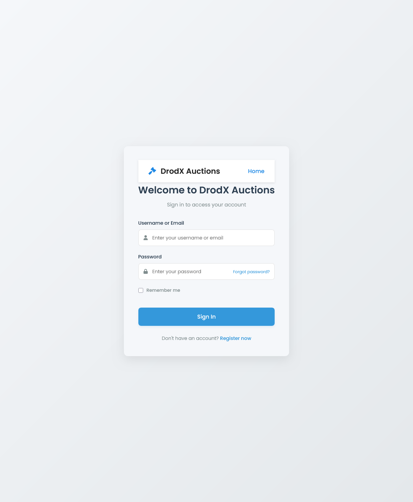
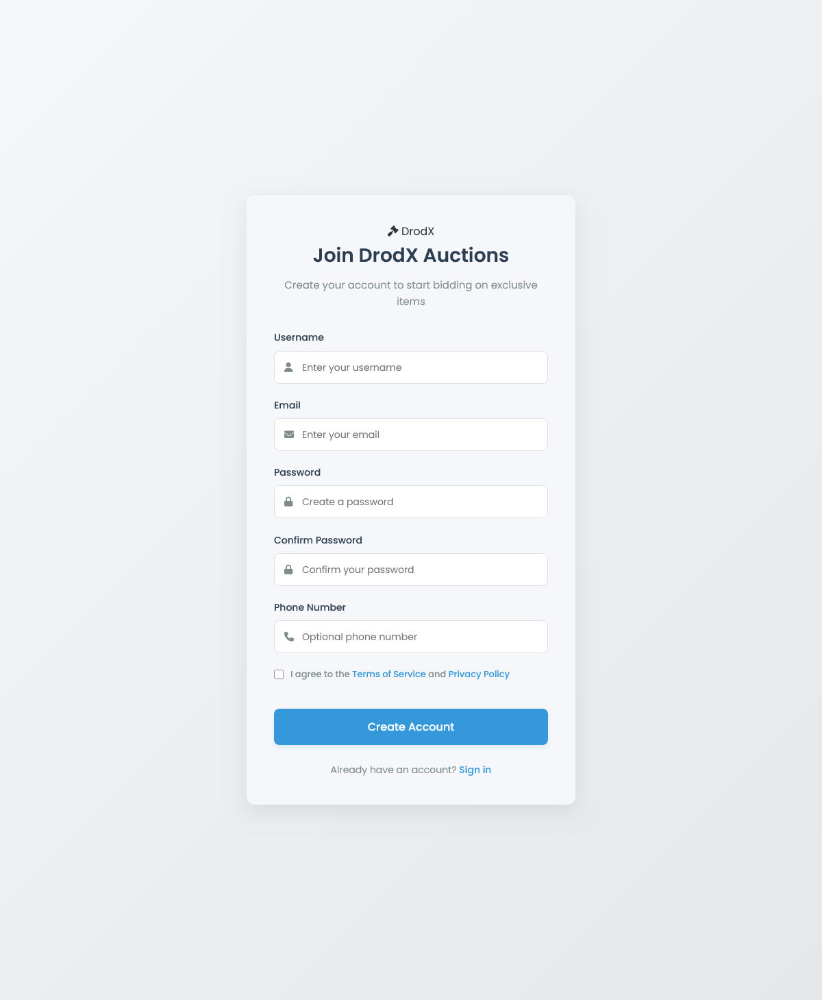
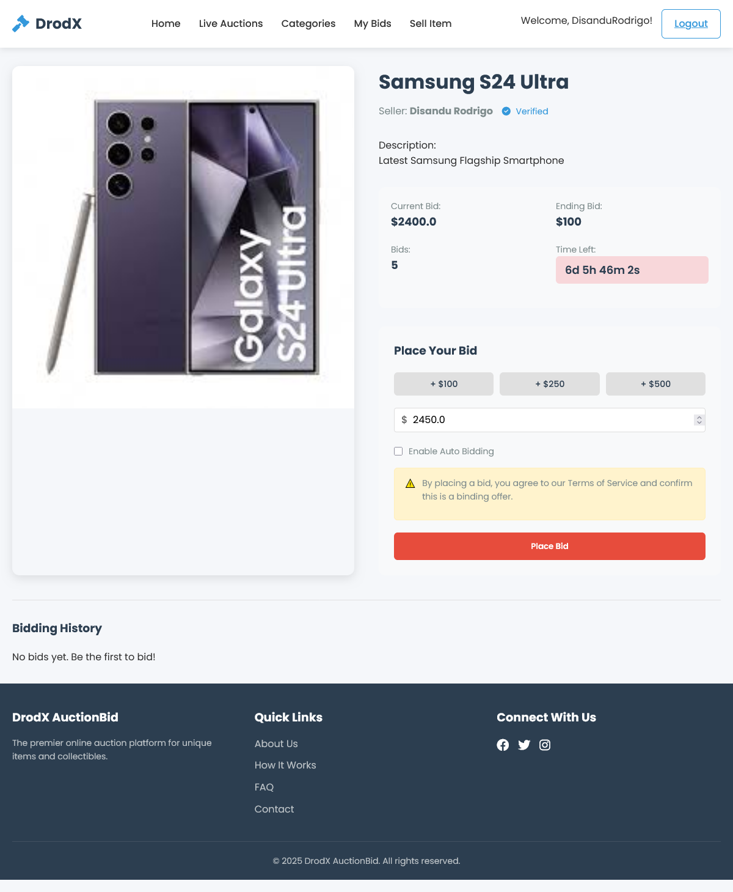

# DrodXAuctionBid 🧩

## 🎯 Project Overview

**DrodXAuctionBid** is a scalable, modular, and database-free Distributed Online Auction System developed using **Java EE technologies** such as **EJB, JMS, and WebSocket (Payara)**. It simulates real-time bidding scenarios with support for **manual and auto-bidding**, designed for academic, enterprise learning, and demonstration purposes.


* Real-time product views
* Manual and auto-bid functionalities
* Live bid updates via WebSocket
* Centralized in-memory data storage for users and products

The system uses **Message-Driven Beans** for asynchronous processing and **Singleton Session Beans** for centralized product and user management.

---

## 🛠️ Technologies Used

* Java 11
* Jakarta EE / Java EE

  * EJB (Stateless and Singleton Session Beans)
  * Message-Driven Beans (MDB)
  * JMS (Java Messaging Service)
  * Servlets
  * WebSocket (Payara Server)
* Gson (for JSON parsing)
* Payara Server (with OpenMQ for JMS)
* HTML, CSS, JavaScript for frontend
* In-memory collections simulate persistence (no external database)

---

## 📦 Architecture

```
Client (Browser)
      ↓
Web Tier (Servlet + HTML/JS/CSS)
      ↓
EJB Tier (Business Logic with Session Beans)
      ↓
Core Module (DTOs, Static Repositories)
```

JMS is used for real-time communication between bidding components, and WebSocket updates clients instantly.

## 📂 Module Structure

```
DrodXAuctionBid/
├── core/           # DTOs, Static data
├── ejb/            # EJBs (Session Beans, Bid Manager, AutoBid Manager)
├── web/            # HTML pages, Servlets, WebSocket endpoints
├── ear/            # EAR module with application.xml
└── README.md
```
---

## ✨ Key Features

### 🔐 User Management

* Registration and login using session beans
* Data stored in-memory without a database

### 🛍️ Product Catalog

* Products loaded statically using shared lists
* No external DB dependency

### ⚙️ Bidding System

* Manual bids processed with concurrency safety
* Auto-bidding engine that increments automatically up to a user's max limit

### ⏱️ Real-time Bidding with JMS + WebSocket

* JMS topics broadcast bid updates
* Web clients receive instant updates via WebSocket

### 🔄 Bid Prioritization

* Manual bids temporarily pause auto-bids
* Queue-based bid handling ensures fairness and order

---


## 🔧 How to Run

1. Clone the repository:

```bash
git clone https://github.com/DisanduRodrigo/DrodXAuctionBid.git
```

2. Use **JDK 11**.
3. Import as a Maven multi-module project in **IntelliJ** or **Eclipse**.
4. Deploy the **EAR module** to **Payara Server**.
5. Access via browser: `http://localhost:8080/DrodXAuctionBid-web`

---


## 🖼️ Screenshots

### Login Page



### Register Page



### Home Page


### Bidding Page




---
## 👥 Contributors

* **Disandu Rodrigo** — Developer & Project Lead


## 📜 License

This project is licensed under the **MIT License**. See `LICENSE.md` for details.

---

⭐ *If you found this project helpful, please give it a star on GitHub!*
